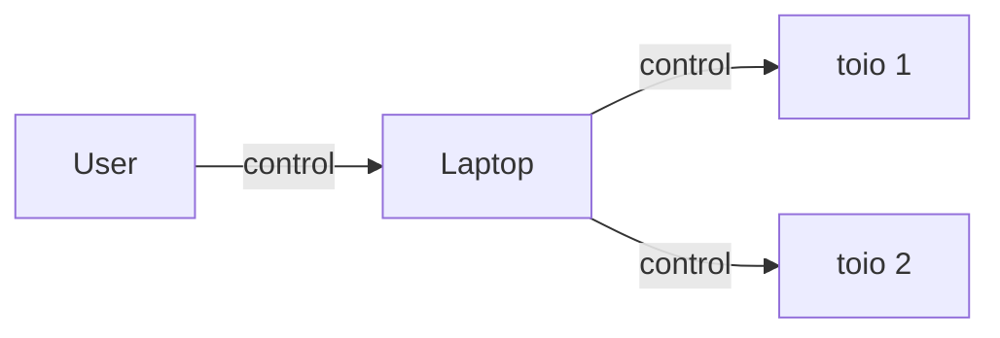

# 運動量非保存の法則

## コンセプト

本作品は、ニュートンのゆりかごをモチーフとした現代的なアート作品です。通常のニュートンのゆりかごは運動量保存則に基づき動作しますが、この作品ではその法則が破れるかのようなユニークな動きを見せます。伝統的なボールの代わりにロボット技術を駆使してボールが作成されており、古典物理学の枠組みを超えた新しい視点を提供します。視覚的な驚きと科学的な興奮を組み合わせた、この革新的なアート作品をぜひご覧ください。

## 技術説明

- Laptop 経由で toio [^1] を動かします。
- 最初に toio1 が動いて、ボールに衝突します。その後 toio2 が想定外の方向に動きます。

[^1]: https://toio.io/
